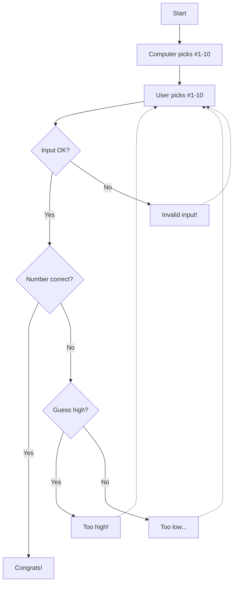

# Game Overview
 1. Guessing game starts
 2. Computer picks a number between 1 to 10
 3. User picks a number between 1 to 10
 4. Computer checks the user's inputs to verify is a number within range
 5. If user's input is okay - follow "_Yes_"  - Computer checks for correct answer  
 If user's input is something wrong - follow "_No_" - Error message and user picks a number between 1 to 10 again
 6. Check for correct answer  
 "_Yes_" - User's guessed number is correct - Computer displays "**Congrats!**"  
 "_No_" - Computer checks whether user's number is higher than computer's number
 7. Computer gives a hint to user  
 If user's number is high - "_Yes_"  Computer displays "**Too high!**"  
 Else -  "_No_" Computer displays "**Too low....**"  
 8. Return to step No.3

